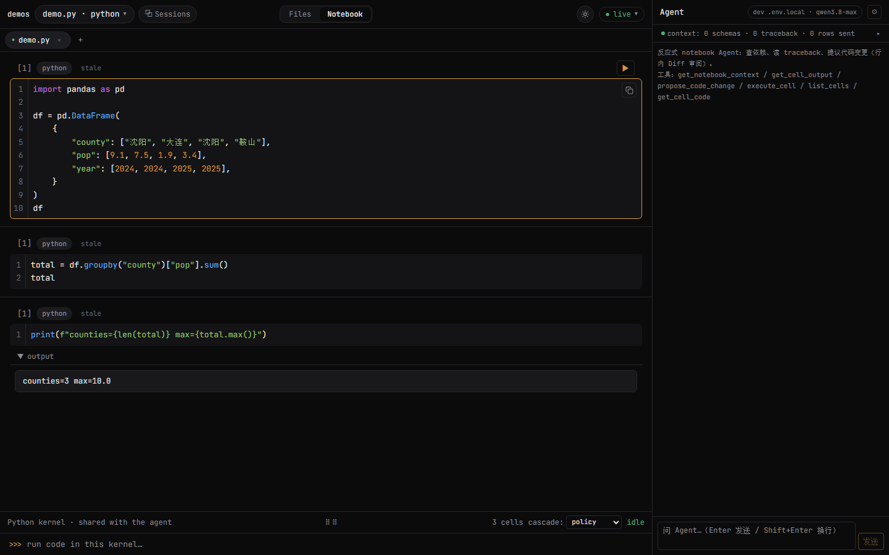
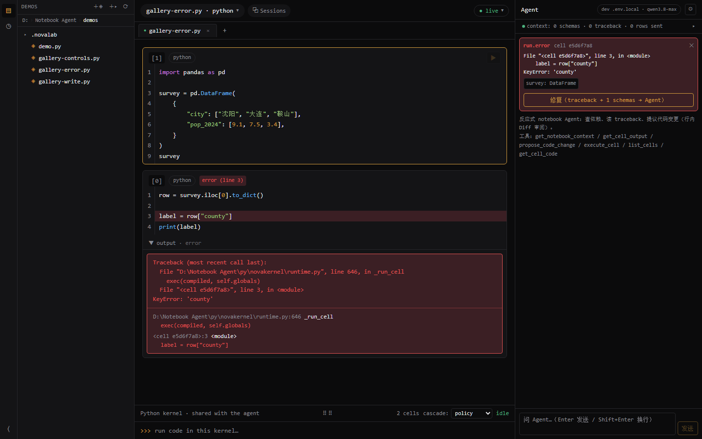
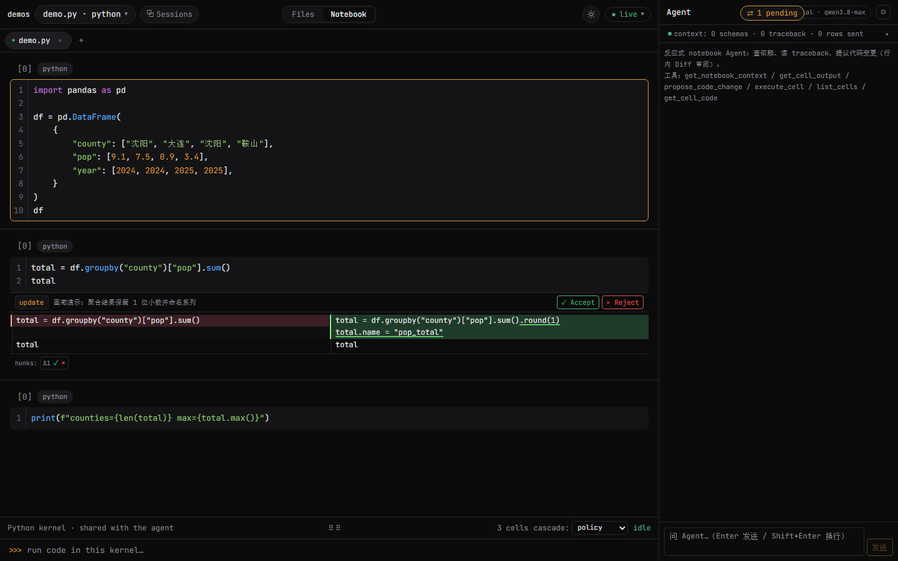
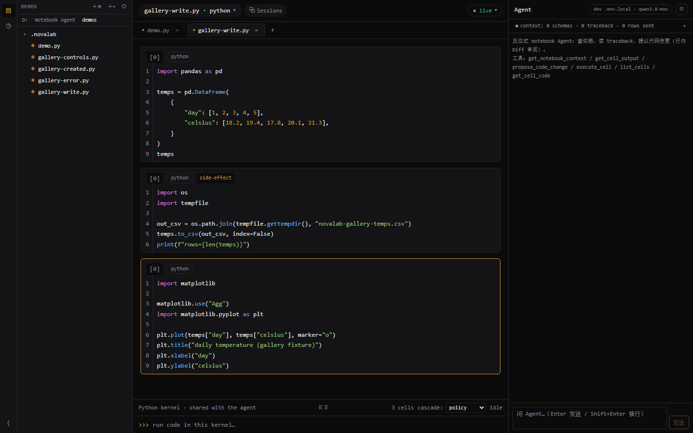

# NovaLab

<!-- badges：OWNER 待仓库建好后替换为实际 GitHub org/user -->
[](https://github.com/OWNER/novalab/actions/workflows/ci.yml)
[](LICENSE)
[](#快速开始)

> **本地优先 · 反应式内核 · Agent 深度协同的桌面科研数据工作台。**
> Local-first reactive notebook where every cell output is provably consistent with the current variable state — and your raw data never leaves the machine.

NovaLab 把 marimo 式反应式执行语义、Claude Science Notebook 式交互范式（clean-room 复刻，见 [NOTICE](NOTICE)）与严格的 LLM 隐私边界结合进一个 Tauri 桌面应用：改上游 cell，下游自动标 stale；报错一键生成行内 Diff，`Tab` 采纳自动重跑；LLM 只看得到代码、traceback、DAG 和 schema 级摘要。

## 特性

- **反应式内核**：AST defs/refs 提取 → 单赋值 DAG → 编辑即失效传播（下游标 stale），级联重跑 / mark-only / ask 三档策略，环与多重定义编译期报错（自研 `novakernel`，语义思路参考 marimo，代码 clean-room，见 [NOTICE](NOTICE)）。
- **Agent 修错闭环**：traceback 自动捕获 → One-click Fix 卡片 → 行内红绿 Diff（CodeMirror MergeView）→ `Tab` 采纳自动重跑 / `Esc` 拒绝；Agent 写入永远 staged，无静默改文件通道。
- **隐私边界（硬保证）**：出进程内容白名单 = 代码 / traceback / DAG / 变量 schema / `head(1)` 级预览，Bridge `PreviewSerializer` 4KB 硬截断（不靠 prompt 自觉），UI 常驻"本次发送了什么"审计 chip。
- **模型解耦**：Anthropic / OpenAI 兼容端点 / DeepSeek / 本地 Ollama(vLLM) 任意 provider；离线模型可全脱网运行。
- **多 Tab 多内核**：一个 tab = 一个 .py 文件 = 一个内核进程，焦点路由，独立 stale/DAG 状态。
- **会话管理**：内核生命周期即会话；历史会话只读浏览、Session 汇总模态（segments 分组）、nbformat 4.5 `.ipynb` 导出/导入。
- **交互控件**：slider / datepicker / table 等原生控件，绑定变量即触发反应式重跑。
- **纯 .py 主存储 + marimo 互转**：`# %% [cell-id]` 块格式，git 友好、冲突粒度 = cell；双向转换器 `python -m novakernel.convert {to-nova|to-marimo}`。
- **MCP server 内置**：外部 Agent（Claude Code / Claude Desktop 等）经 stdio 接入同一个 notebook，与前端共用同一工具集与审阅通道。

## 架构

```
+--------------------------------------------------------------+
|  Tauri 桌面壳 (Rust) —— 窗口 · spawn Bridge · P4 打包          |
+--------------------------------------------------------------+
|  React 19 前端 (app/)  CM6 编辑器 · 行内 Diff · AgentPanel    |
+--------------------------------------------------------------+
        |  WebSocket · JSON-RPC 2.0 (ws://127.0.0.1:7788)
+--------------------------------------------------------------+
|  Bridge (bridge/, node TS 独立进程)                            |
|  RPC router · KernelSupervisor(1 文件=1 内核进程)              |
|  PreviewSerializer(隐私硬截断) · SessionLogger · MCP(stdio)   |
+--------------------------------------------------------------+
        |  stdin/stdout JSON-lines
+--------------------------------------------------------------+
|  novakernel (py/, Python 子进程)                               |
|  dag.py · runtime.py · introspect.py · serialize.py · server  |
+--------------------------------------------------------------+
```

完整版见 [docs/spec.md §1](docs/spec.md)。进程不变量：前端永不直接碰 Python；**所有给 LLM 的数据必须经过 Bridge 的 PreviewSerializer**。

## 快速开始

前置：Node ≥ 22 + pnpm ≥ 9，Python ≥ 3.11 + [uv](https://docs.astral.sh/uv/)，（可选，桌面壳）Rust stable。

```bash
git clone https://github.com/OWNER/novalab.git && cd novalab
pnpm install                              # app + bridge 依赖
uv sync --directory py --all-extras       # novakernel 依赖
```

LLM 凭据（可选——不配则 Agent 面板离线降级，其余功能全部可用）。新建 `app/.env.local`（已 gitignore，**永不提交**）：

```bash
VITE_NOVALAB_LLM_BASE_URL=https://your-anthropic-compatible-endpoint
VITE_NOVALAB_LLM_API_KEY=sk-...
VITE_NOVALAB_LLM_MODEL=claude-sonnet-4-5   # 可省略，有默认值
```

三个终端：

```bash
pnpm dev:bridge    # 终端 1：Bridge，ws://127.0.0.1:7788（内核进程由它按需自动 spawn）
pnpm dev:app       # 终端 2：前端，http://localhost:5199
pnpm kernel        # 终端 3（可选）：手动起 novakernel 调试协议帧；日常不需要
```

打开浏览器访问 http://localhost:5199，从左侧文件树打开 `demos/demo.py`。桌面壳开发模式：`pnpm --filter @novalab/app exec tauri dev`。

## 画廊

真机截图（`scripts/demo-gallery.mjs` 生成，bridge/novakernel 均为真进程）：

| 反应式 stale | 修错 Fix 卡片 | 行内 Diff 审阅 | 多 Tab 多内核 |
|---|---|---|---|
|  |  |  |  |

全部 17 态与逐功能证据（✅34/🟡5/⛔1）见 [功能矩阵](docs/demos/feature-matrix.md)。

## MCP 接入

Bridge 内置 MCP stdio server，外部 Agent 直接读写审阅通道内的 notebook（摘要自 [docs/mcp-demo.md](docs/mcp-demo.md)）：

```bash
claude mcp add novalab -- pnpm --dir "<repo>/bridge" exec tsx src/main.ts --mcp "<repo>/demos/demo.py"
```

六工具（`get_notebook_context` / `get_cell_output` / `propose_code_change` / `execute_cell` / `list_cells` / `get_cell_code`）与前端 in-process 工具同源同路由，**不存在特权写入通道**；`propose_code_change` 只产生 staged diff，仍需前端 `Tab`/`Esc` 审阅。

## 开发工作流

测试门（CI 同款，PR 必须全绿）：

```bash
pnpm --filter @novalab/bridge exec tsc --noEmit && pnpm --filter @novalab/app exec tsc --noEmit
pnpm --filter @novalab/bridge exec vitest run
pnpm --filter @novalab/app exec vitest run
uv run --directory py pytest
node scripts/integration-smoke.mjs            # bridge + kernel 端到端（起停自管）
pnpm exec playwright install chromium         # 首次
node scripts/demo-gallery.mjs --skip-agent    # 交互状态画廊（无 LLM 凭据态）
```

详见 [CONTRIBUTING.md](CONTRIBUTING.md)（含 clean-room 纪律）与 [docs/plan.md](docs/plan.md)。

## 文档

- [docs/intent.md](docs/intent.md) — 愿景、需求（MoSCoW）、ADR 决策记录
- [docs/spec.md](docs/spec.md) — 架构、协议、内核语义（规范）、工具 schema、UI 规格
- [docs/plan.md](docs/plan.md) — spike/门、四阶段 WBS、风险登记
- [docs/mcp-demo.md](docs/mcp-demo.md) — MCP 接入完整示例

## 路线

P1 内核+编辑器+Bridge ✅ · P2 Agent 闭环+文件/会话管理 ✅ · P3 多 Tab+控件+互转 ✅ · **P4 进行中**：Tauri 打包流水线（CI 见 `.github/workflows/release.yml`）、凭据 keychain/加密存储迁移、App View、i18n。

## License

Apache-2.0，见 [LICENSE](LICENSE)。第三方参考与 clean-room 边界声明见 [NOTICE](NOTICE)。
